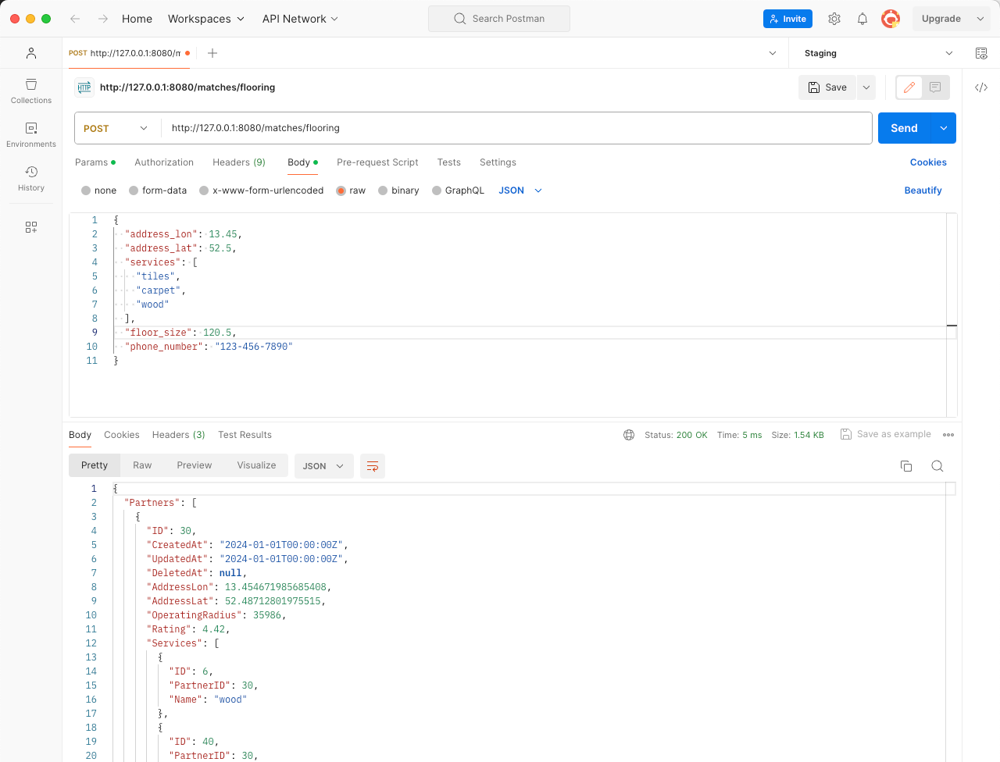

# Go Assignment Partner Matching

## Notes and Comments

1. In this implementation, the initial SQL request for Partners does not account
for filtering based on the distance from the request. This is applied later by
using the haversine function. In some instances, this approach may result in fewer
matches since the initial database request is limited for security reasons, and too
many Partners could be filtered out afterward. Therefore, integrating the distance
calculation directly into the database (e.g., as a stored procedure) is preferable.

2. The final sorting is implemented in a binary fashion according to your feature
description. However, since the Partner scores are represented as floats, the
secondary sorting by distance would never be applied. Therefore, we could either
round the score values or opt for a weighted sorting function that considers both
score and distance with varying weights.

3. The implementation, documentation, and testing are somewhat cursory in places,
serving merely to demonstrate the proof-of-concept.

## Setup (macOS)

    > brew bundle
    > go build -o matching && ./matching

## Run Tests

    > go test
      PASS
      ok      matching        0.383s

## Show Seed Data

    > open http://localhost:8080/partners

## Execute Example Query

    > PARM=$(echo -n '{"address_lon": 13.45, "address_lat": 52.5, "services": ["tiles", "carpet"], "floor_size": 120.5, "phone_number": "123-456-7890"}' | jq -s -R -r @uri)

    > curl "http://localhost:8080/matches/flooring?q=$(echo -n $PARM)" | jq .
      {
        "Partners": [
          {
            "ID": 7,
            "CreatedAt": "2024-01-01T00:00:00Z",
            "UpdatedAt": "2024-01-01T00:00:00Z",
            "DeletedAt": null,
            "AddressLon": 13.45036030348532,
            "AddressLat": 52.50976154042684,
            "OperatingRadius": 32709,
            "Rating": 4.96,
            "Services": [
              {
                "ID": 39,
                "PartnerID": 7,
                "Name": "tiles"
              },
      [...]

## Open Swagger Docs

    > open "http://localhost:8080/swagger/index.html#/matches/get_matches_flooring"

